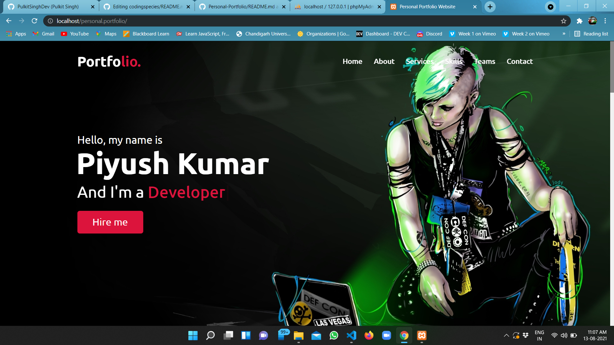
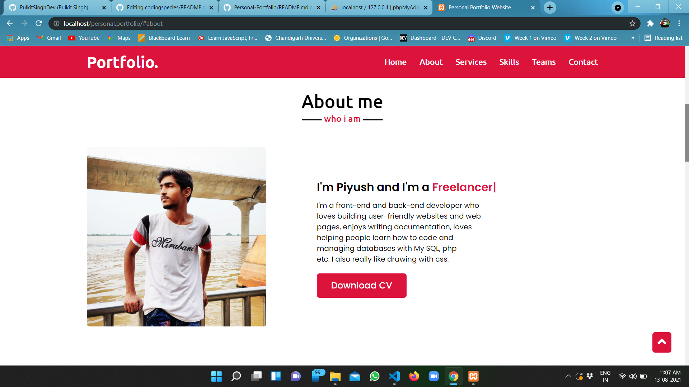
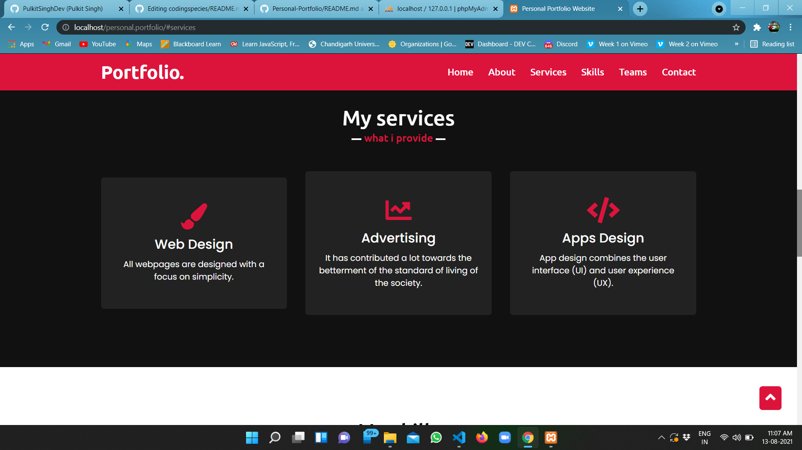
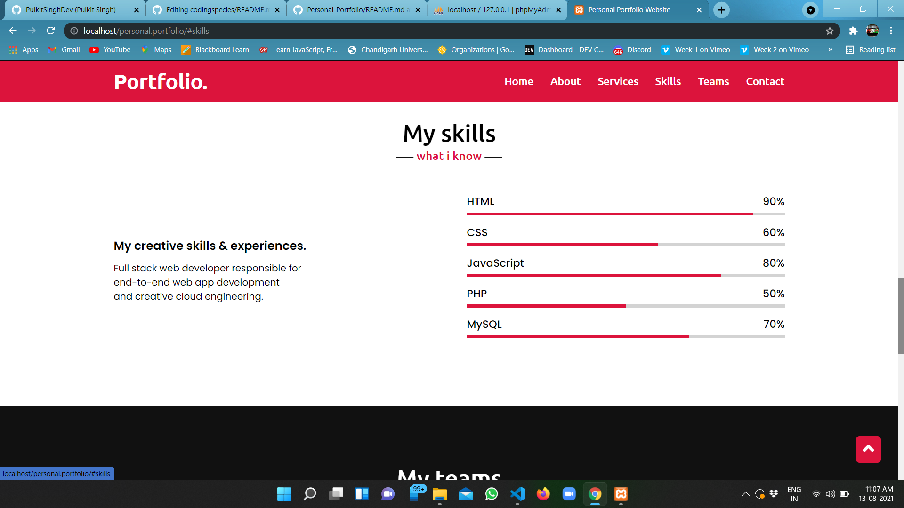
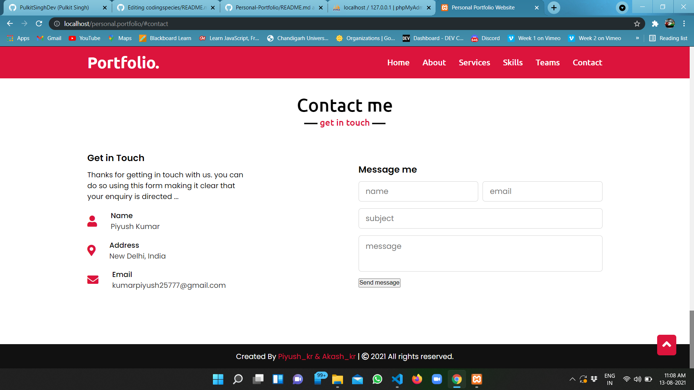

<h1><strong><em>Heyy! </em></strong>🐱‍💻</h1>
 
        
 
 
 
 # Personal-Portfolio

## This is my Personal Portfolio Website!!!

# To see the output [CLICK HERE](https://piyush168713.github.io/Coursera-HTML-CSS-JavaScript-for-Web-Developers/Module-5/index.html)

### Screenshots

`Home Page`

`About Page`

`Services Page`

`Skills Page`

`Contact Us Page`

